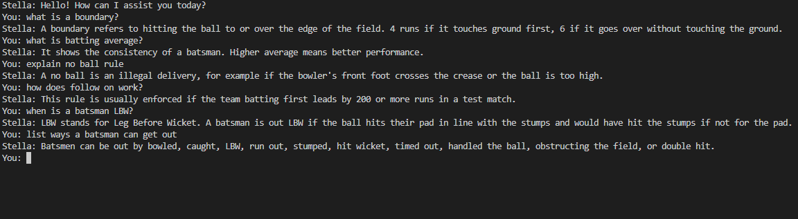

# Stella – The Cricket Chatbot

An intelligent chatbot that teaches users about cricket rules and concepts.

## Description

In **Stella**, users can ask questions about cricket and receive informative, friendly responses. The bot uses a structured set of patterns and intents to understand user queries. With topics ranging from "What is a run?" to "What is strike rate?", Stella is designed to be both educational and interactive. The dataset can be expanded, and the responses are customizable. This chatbot is a great entry point into conversational AI with real-world utility.

## Features

- **Intent Classification**: Matches user queries to predefined cricket topics.
- **Natural Language Processing**: Uses tokenization, stemming, and bag-of-words.
- **Custom Dataset**: Easy to modify or expand using `intents.json`.
- **Neural Network Model**: Includes training logic using TensorFlow and Keras.
- **Reusable Components**: Preprocessed data and trained model are saved using Pickle and H5.
- **Extensible Design**: Integrate with any chat interface or web app.

## Technologies Used

- **Python**
- **NLTK** – for tokenization and stemming.
- **NumPy** – for vector and matrix processing.
- **Pickle** – for saving preprocessed word and class data.
- **TensorFlow (Keras)** – for building and training the neural network model.

## Screenshots

### Chatbot Preview

## Future Improvements

- Build a graphical interface using Flask or Streamlit.
- Support voice input and speech output.
- Track conversation history and improve contextual flow.
- Add more intents, including general conversation and user feedback.
- Log user queries and adapt responses using active learning.
